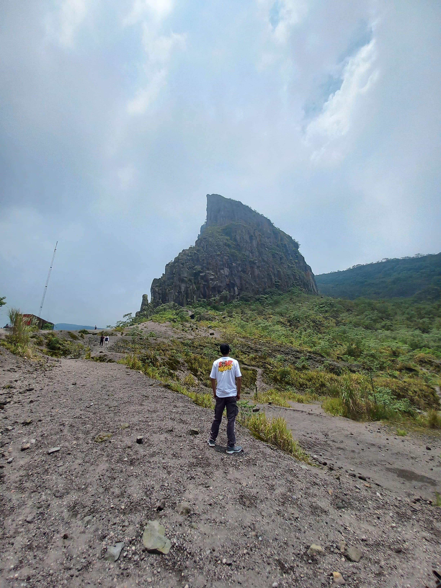
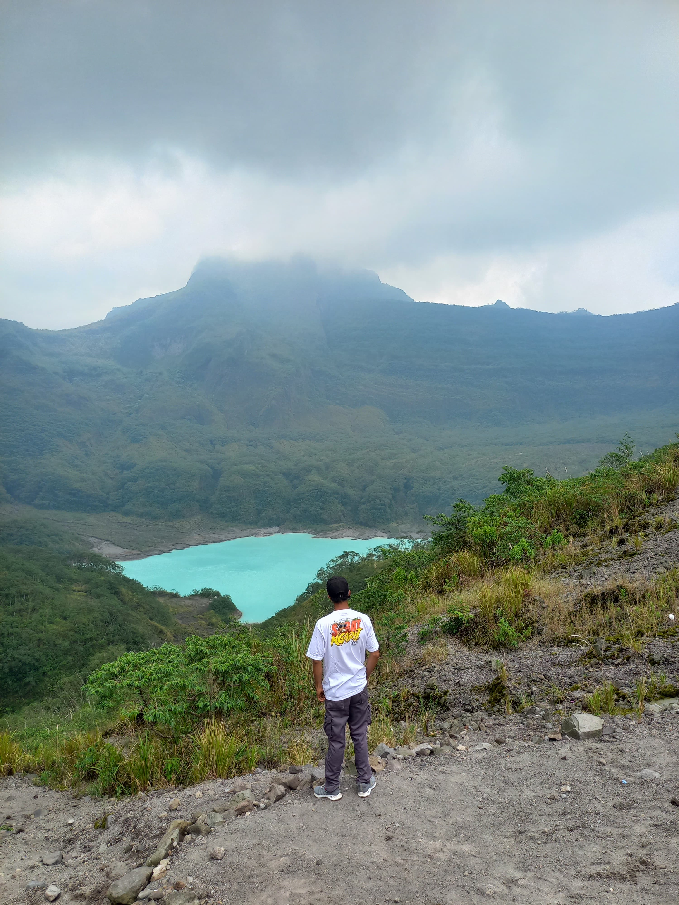
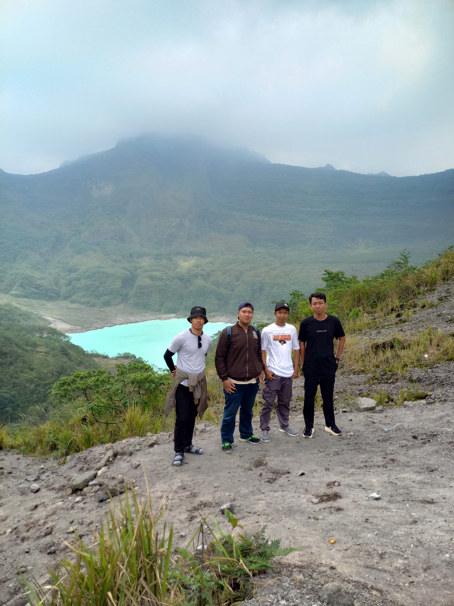

Selain ke bromo saya sebenarnya ingin ke gunung kelud yang mana keindahan alam nya sangatlah bagus banget ditambah lagi tidak perlu sesah payah mendaki untuk bisa menikmati kawah gunung kelud ini. 

Seperti halnya bromo gunung kelud ini memiliki keindahan yang cocok untuk memanjakan mata, yang membedakan hanya harga tiket nya aja dan ramainya pengunjung disana. 

Di kelud kalian cukup bayar 10 ribu perorang sudah bisa menikmati keindahan gunung kelud jika tidak ingin capek mendaki ya harus menyewa jasa ojek yang mana harus membayar dengan harga 40 ribu bisa PP atau tidak. 

Di gunung kelud tidak hanya keindahan alam nya ada juga buah nanas nya yang bisa kalian bawa pulang untuk oleh - oleh orang dirumah, harganya pun sangatlah terjangkau dimana harga 15 ribu  bisa mendapatkan 1 ikat dimana setiap ikatnya berisi empat atau 3 . 

Perjalanan gunung kelud dari lamongan termasuk lama sekitar 2 jam namun jalan nya mulus, kalau via jombang kalian bisa memilih  via pare bisa atau ambil jalur malang batu juga bisa, karena jalan nya satu arah. 

Kalau ingin memakai map kemungkinan akan kalian akan disasarkan ke kebun karet dan kebun nanas jadi lebih baik liat plang jalan aja, kalau ingin via gumul juga bisa jadi banyak sekali jalur wisata ke gunung kelud ini. 

Setelah dari gunung kelud liburan kemana lagi . . . .
